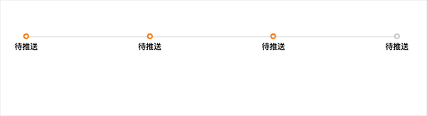

### progress
最近做了一个简单的LESS动态添加流出步骤进度条

| 属性 | 注释 | 默认值 |
|-|-|
| on | 激活状态，在active状态的之前的状态| g-progress-on |
| active | 被激活的状态 动态的git状态 | g-progress-active |
|color| 颜色 | #ff8800 |
| position| 可以设置激活的位置，如果设置这个值会首先执行 | 1 |
| targets | 节点  | g-progress-point |
| animate | 动画 | {}  |
| tagH | 动态条的宽度 | 2 |


example
```html
<div class="box">
    <div class="g-progress-box" id='progress'>
        <div class="g-progress-point g-progress-stage1">
            <span class="g-progress-cir"></span>
            <div class="g-progress-detail">
                <h4>待推送</h4>
            </div>
        </div>
        <div class="g-progress-point g-progress-stage2">
            <span class="g-progress-cir"></span>
            <div class="g-progress-detail">
                <h4>待推送</h4>
            </div>
        </div>
        <div class="g-progress-point g-progress-stage3">
            <span class="g-progress-cir"></span>
            <div class="g-progress-detail">
                <h4>待推送</h4>
            </div>
        </div>
        <div class="g-progress-point g-progress-stage4">
            <span class="g-progress-cir"></span>
            <div class="g-progress-detail">
                <h4>待推送</h4>
            </div>
        </div>

    </div>
</div>
<script type="text/javascript" src='./index.js'></script>
<script>
    $('#progress').progress({
        // 'position':2
    });
</script>

```

